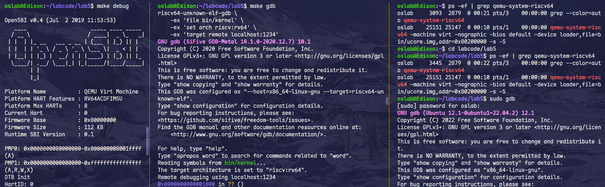

# Lab 5 实验报告

## 练习1: 加载应用程序并执行

> **do_execve**函数调用`load_icode`（位于kern/process/proc.c中）来加载并解析一个处于内存中的ELF执行文件格式的应用程序。你需要补充`load_icode`的第6步，建立相应的用户内存空间来放置应用程序的代码段、数据段等，且要设置好`proc_struct`结构中的成员变量trapframe中的内容，确保在执行此进程后，能够从应用程序设定的起始执行地址开始执行。需设置正确的trapframe内容。
>
> 请在实验报告中简要说明你的设计实现过程。
>
> - 请简要描述这个用户态进程被ucore选择占用CPU执行（RUNNING态）到具体执行应用程序第一条指令的整个经过。

### 1. 设计实现过程

在 `load_icode` 函数中，前面的步骤已经完成了建立内存映射、拷贝代码段和数据段等工作。第6步的核心任务是初始化当前进程的中断帧（trapframe），这是为了让该进程在被调度执行时，能够通过中断返回（sret）的方式，“假装”从内核态返回到用户态，并跳转到程序的入口处开始执行。

```c
// 位于 kern/process/proc.c 的 load_icode 函数末尾部分

    //(6) setup trapframe for user environment
    struct trapframe *tf = current->tf;
    // Keep sstatus
    uintptr_t sstatus = tf->status;
    memset(tf, 0, sizeof(struct trapframe));
    /* LAB5:EXERCISE1 2311983
    * should set tf->gpr.sp, tf->epc, tf->status
    * NOTICE: If we set trapframe correctly, then the user level process can return to USER MODE from kernel. So
    * tf->gpr.sp should be user stack top (the value of sp)
    * tf->epc should be entry point of user program (the value of sepc)
    * tf->status should be appropriate for user program (the value of sstatus)
    * hint: check meaning of SPP, SPIE in SSTATUS, use them by SSTATUS_SPP, SSTATUS_SPIE(defined in risv.h)
    */
    
    // 设置状态寄存器：
    // 1. SSTATUS_SPP = 0: 表示进入中断之前的特权级是 User Mode (这样 sret 后会回到用户态)
    // 2. SSTATUS_SPIE = 1: 表示开启中断 (允许响应中断)
    tf->status = (sstatus | SSTATUS_SPIE) & ~SSTATUS_SPP;

    // 设置 sepc (Exception Program Counter):
    // 指向 ELF 文件头中记录的程序入口地址，sret 后 PC 会跳转到这里
    tf->epc = elf->e_entry;

    // 设置 sp (Stack Pointer):
    // 指向用户栈的栈顶地址 USTACKTOP
    tf->gpr.sp = USTACKTOP;

    ret = 0;
// ... (后续代码)
```

具体实现主要包含以下针对 `tf` (trapframe) 结构体的设置：

- **状态寄存器 (status)**: 需要设置 `SSTATUS_SPP` 为 0。因为 `SPP` 记录的是“进入中断前的特权级”，我们要让 CPU 执行 `sret` 后进入用户态（User Mode），所以这里必须设为 0。同时，需要将 `SSTATUS_SPIE` 设置为 1，这样进入用户态后能够响应中断（开启中断）。
- **程序计数器 (epc)**: 将 `tf->epc` 设置为 ELF 文件头中记录的程序入口地址 (`elf->e_entry`)。这样当 `sret` 指令将 `epc` 的值恢复到 PC 寄存器时，CPU 就会直接跳转到应用程序的第一条指令。
- **栈指针 (sp)**: 将 `tf->gpr.sp` 设置为用户栈的栈顶地址 (`USTACKTOP`)。这是为了保证用户程序在执行时有可用的栈空间。

简而言之，这一步就是在内核栈顶伪造了一个“来自用户态的中断现场”，调度器只需执行恢复现场的操作，就能把 CPU “弹”到用户程序里去。

### 2. 从 RUNNING 态到执行第一条指令的经过

当这个用户态进程（实际上在 `lab5` 初始化阶段，最开始是 `user_main` 内核线程通过 `kernel_execve` 演变而来的）被调度器选择为 `RUNNING` 态占用 CPU 后，流程如下：

1. **内核线程发起调用**: `user_main` 调用 `kernel_execve`，函数内部通过内联汇编执行 `ebreak`（并设置 `a7=10`）触发断点异常，从而模拟系统调用机制进入异常处理流程。
2. **异常分发**: CPU 跳转到 `__alltraps` 保存上下文，进入 `trap()`，再到 `exception_handler()`。
3. **系统调用转发**: 异常处理代码识别出是断点异常且 `a7==10`，于是调用 `syscall()`，接着转发给 `sys_exec`，最终调用到 `do_execve`。
4. **加载程序**: `do_execve` 清空当前进程的内存空间，调用 `load_icode` 将 ELF 二进制文件加载到内存，并按照上述设计过程设置好 `trapframe`（EP 指向程序入口，SP 指向用户栈，状态为 User Mode）。
5. **返回中断**: `do_execve` 执行完毕层层返回，直到 `__trapret`（在 `trapentry.S` 中）。
6. **恢复现场**: 执行 `RESTORE_ALL`，此时从栈上恢复的寄存器数据正是我们在 `load_icode` 中伪造的那个 `trapframe`。
7. **模式切换**: 执行 `sret` 指令。CPU 根据 `sstatus` 的 `SPP` 位（已设为 0）切换到用户态，并将 `sepc`（已设为程序入口）加载到 PC。
8. **执行**: 此时 CPU 处于用户态，PC 指向应用程序入口，正式开始执行用户程序的第一条指令。

------

## 练习2: 父进程复制自己的内存空间给子进程

> 创建子进程的函数`do_fork`在执行中将拷贝当前进程（即父进程）的用户内存地址空间中的合法内容到新进程中（子进程），完成内存资源的复制。具体是通过`copy_range`函数（位于kern/mm/pmm.c中）实现的，请补充`copy_range`的实现，确保能够正确执行。
>
> 请在实验报告中简要说明你的设计实现过程。
>
> - 如何设计实现`Copy on Write`机制？给出概要设计，鼓励给出详细设计。
>
> > Copy-on-write（简称COW）的基本概念是指如果有多个使用者对一个资源A（比如内存块）进行读操作，则每个使用者只需获得一个指向同一个资源A的指针，就可以该资源了。若某使用者需要对这个资源A进行写操作，系统会对该资源进行拷贝操作，从而使得该“写操作”使用者获得一个该资源A的“私有”拷贝—资源B，可对资源B进行写操作。该“写操作”使用者对资源B的改变对于其他的使用者而言是不可见的，因为其他使用者看到的还是资源A。

### 1. 设计实现过程

`do_fork` 在创建子进程时，需要通过 `copy_mm` 函数复制父进程的内存空间。`copy_mm` 最终会调用 `copy_range` 来完成具体的页表复制和物理内存拷贝。

```c
// 位于 kern/process/proc.c 的 alloc_proc 函数中
    if (proc != NULL)
    {
        // ... (LAB4 的初始化代码保持不变) ...
        proc->state = PROC_UNINIT;
        proc->pid = -1;
        proc->runs = 0;
        proc->kstack = 0;
        proc->need_resched = 0;
        proc->parent = NULL;
        proc->mm = NULL;
        memset(&(proc->context), 0, sizeof(struct context));
        proc->tf = NULL;
        proc->pgdir = boot_pgdir_pa;
        proc->flags = 0;
        memset(proc->name, 0, PROC_NAME_LEN + 1);

        // LAB5 2311983 : (update LAB4 steps)
        /*
         * below fields(add in LAB5) in proc_struct need to be initialized
         * uint32_t wait_state;                        // waiting state
         * struct proc_struct *cptr, *yptr, *optr;     // relations between processes
         */
         
        // 初始化进程关系指针和等待状态
        proc->wait_state = 0;
        proc->cptr = NULL;  // child pointer
        proc->optr = NULL;  // older sibling pointer
        proc->yptr = NULL;  // younger sibling pointer
    }
    return proc;
```

```c
// 位于 kern/process/proc.c 的 do_fork 函数中

    // ... (前 4 步代码保持不变) ...
    
    // 4. 调用copy_thread设置proc_struct中的tf和context
    copy_thread(proc, stack, tf);

    // 5. insert proc_struct into hash_list && proc_list
    // LAB5 2311983 : (update LAB4 steps)
    // TIPS: you should modify your written code in lab4(step1 and step5), not add more code.
    /* Some Functions
     * set_links:  set the relation links of process.  ALSO SEE: remove_links:  lean the relation links of process
     * -------------------
     * update step 1: set child proc's parent to current process, make sure current process's wait_state is 0
     * update step 5: insert proc_struct into hash_list && proc_list, set the relation links of process
     */
    
    bool intr_flag;
    local_intr_save(intr_flag);
    {
        proc->pid = get_pid();
        hash_proc(proc);
        
        // LAB5 修改：使用 set_links 替代 list_add
        // set_links 会设置父子、兄弟链表，并将进程加入 proc_list
        set_links(proc); 
    }
    local_intr_restore(intr_flag);

    // 6. call wakeup_proc to make the new child process RUNNABLE
    wakeup_proc(proc);

    // ... (后续代码)
```

```c
// 位于 kern/mm/pmm.c 的 copy_range 函数中

            /* LAB5:EXERCISE2 2311983
            * replicate content of page to npage, build the map of phy addr of
            * nage with the linear addr start
            *
            * Some Useful MACROs and DEFINEs, you can use them in below
            * implementation.
            * MACROs or Functions:
            * page2kva(struct Page *page): return the kernel vritual addr of
            * memory which page managed (SEE pmm.h)
            * page_insert: build the map of phy addr of an Page with the
            * linear addr la
            * memcpy: typical memory copy function
            *
            * (1) find src_kvaddr: the kernel virtual address of page
            * (2) find dst_kvaddr: the kernel virtual address of npage
            * (3) memory copy from src_kvaddr to dst_kvaddr, size is PGSIZE
            * (4) build the map of phy addr of  nage with the linear addr start
            */
            
            // 1. 获取源页面(父进程)的内核虚拟地址
            void *kva_src = page2kva(page);
            // 2. 获取目标页面(子进程)的内核虚拟地址
            void *kva_dst = page2kva(npage);
            
            // 3. 复制内存内容 (4KB)
            memcpy(kva_dst, kva_src, PGSIZE);
            
            // 4. 建立物理地址与线性地址的映射
            // 注意：perm 需要沿用父进程的权限 (*ptep & PTE_USER)
            ret = page_insert(to, npage, start, perm);

            assert(ret == 0);
```

`copy_range` 的实现逻辑如下：

- **遍历地址空间**: 按照页大小（4KB）逐页遍历父进程指定的内存范围（start 到 end）。
- **检查父进程页表**: 对于每一个地址，先检查父进程的页表项（PTE）。如果 PTE 不存在或无效（没有 `PTE_V` 位），则跳过。
- **分配物理内存**: 如果父进程有有效的物理页，就调用 `alloc_page()` 为子进程申请一个新的物理页。
- **内容拷贝**: 获取父进程物理页的内核虚拟地址（`page2kva`）和子进程新页的内核虚拟地址，使用 `memcpy` 将父进程页面的内容完全拷贝到子进程的新页中。
- **建立映射**: 调用 `page_insert`，将子进程的新物理页映射到子进程的页表中。重要的是，映射的权限（`perm`）应当与父进程该页的权限保持一致（通常是 `PTE_USER` 等）。

### 2. Copy on Write (COW) 机制设计

COW 机制的核心思想是“推迟拷贝”，即 Fork 时不立即复制物理内存，而是让父子进程共享同一块物理内存，直到有一方尝试写入时才真正进行拷贝。

**概要设计：**

1. **Fork 阶段 (修改 `copy_range`)**:
   - 在复制内存时，不再申请新物理页和 memcpy。
   - 直接将子进程的 PTE 指向父进程对应的同一个物理页。
   - **关键点**: 将父进程和子进程的该页 PTE 权限都设置为**只读**（去掉 `PTE_W` 位），哪怕它原本是可写的。同时，需要在页结构（Page Struct）中维护引用计数，或者利用 PTE 的保留位标记这是一个 COW 页。
2. **写操作触发 (缺页异常)**:
   - 当父进程或子进程尝试向这个“只读”页面写入数据时，CPU 会触发 `Store/AMO Page Fault` 异常。
3. **异常处理 (修改 `do_pgfault`)**:
   - 在缺页中断处理函数中，检测异常原因。如果是因为写权限违规，且该页被标记为 COW 页：
     - **分配**: 申请一个新的物理页。
     - **拷贝**: 将原共享页面的内容拷贝到新页。
     - **重映射**: 修改当前进程的页表，让其指向新分配的物理页，并将权限恢复为**可写**。
     - **引用计数递减**: 原共享物理页的引用计数减 1。
4. **特殊情况**: 如果写操作发生时，物理页的引用计数已经是 1（说明另一个进程已经退出了或者已经 COWed 了），则不需要分配新页，直接把当前页权限改回可写即可。

------

## 练习3: 阅读分析源代码，理解进程执行 fork/exec/wait/exit

> 请在实验报告中简要说明你对 fork/exec/wait/exit函数的分析。并回答如下问题：
>
> - 请分析fork/exec/wait/exit的执行流程。重点关注哪些操作是在用户态完成，哪些是在内核态完成？内核态与用户态程序是如何交错执行的？内核态执行结果是如何返回给用户程序的？
> - 请给出ucore中一个用户态进程的执行状态生命周期图（包执行状态，执行状态之间的变换关系，以及产生变换的事件或函数调用）。（字符方式画即可）
>
> 执行：make grade。如果所显示的应用程序检测都输出ok，则基本正确。（使用的是qemu-4.1.1）

```c
// 位于 kern/trap/trap.c 的 interrupt_handler 函数中

    case IRQ_S_TIMER:
        /* LAB5 GRADE   2311983 :  */
        /* 时间片轮转： 
        *(1) 设置下一次时钟中断（clock_set_next_event）
        *(2) ticks 计数器自增
        *(3) 每 TICK_NUM 次中断（如 100 次），进行判断当前是否有进程正在运行，如果有则标记该进程需要被重新调度（current->need_resched）
        */
        
        // 1. 设置下一次时钟中断
        clock_set_next_event();

        // 2. ticks 计数器自增
        ticks++;

        // 3. 判断时间片是否耗尽
        if (ticks % TICK_NUM == 0) {
            // 检查当前是否有进程在运行（不是空闲进程）
            // 实际上 idleproc 也可以被调度出去，所以主要判断 current != NULL
            if (current != NULL && current != idleproc) {
                // 标记该进程需要被重新调度
                current->need_resched = 1;
            }
        }
        break;
```

### 1. fork/exec/wait/exit 执行流程分析

**总体流程与交错执行：** 用户进程通过系统调用（`ecall` 指令）主动陷入内核态，内核处理完毕后通过 `sret` 返回用户态。

- **fork (创建进程)**:
  - **用户态**: 调用 `fork()`。
  - **内核态**: `sys_fork` -> `do_fork`。内核分配新的 PCB，分配内核栈，**复制**父进程的内存布局（页表）和上下文（trapframe）。
  - **返回**: 父进程返回子进程 PID，子进程返回 0。这是通过修改父子进程 `trapframe->gpr.a0` 寄存器实现的。
  - **交错**: 父进程继续执行；子进程被加入调度队列，等待被 `schedule()` 调度选中后开始执行。
- **exec (替换程序)**:
  - **用户态**: 调用 `exec()`。
  - **内核态**: `sys_exec` -> `do_execve`。内核回收当前进程的内存空间（页表），加载新程序的二进制代码（`load_icode`），重置用户栈和中断帧。
  - **返回**: 成功时不返回原来的代码位置，而是通过 `sret` 跳转到新程序的入口点。
- **wait (等待子进程)**:
  - **用户态**: 调用 `wait()`。
  - **内核态**: `sys_wait` -> `do_wait`。内核检查是否有子进程处于 `ZOMBIE` 状态。
    - 如果有，回收该子进程剩余资源（PCB、内核栈），返回子进程 PID。
    - 如果没有退出的子进程，当前进程状态置为 `SLEEPING`，并主动调用 `schedule()` 让出 CPU。
  - **交错**: 当前进程休眠，CPU 切换到其他进程（如子进程）。当子进程退出时会唤醒父进程，父进程再次进入 `RUNNABLE` 态，下次被调度时从 `schedule()` 后继续执行，完成回收。
- **exit (进程退出)**:
  - **用户态**: 调用 `exit()`。
  - **内核态**: `sys_exit` -> `do_exit`。内核释放进程的大部分内存（页表、mm结构），将状态设为 `ZOMBIE`，设置退出码。
  - **关键操作**: 唤醒父进程（如果父进程在 wait），并将自己的子进程过继给 `init` 进程。最后调用 `schedule()` 也就是自杀后让出 CPU，永远不再返回用户态。

**内核态结果如何返回给用户程序？** 系统调用的返回值（如 fork 的 pid，read 的字节数）是通过 **寄存器 `a0`** 传递的。在 `trap` 处理结束前，内核会将返回值写入当前进程 `trapframe->gpr.a0` 中。当执行 `sret` 恢复现场时，物理寄存器 `a0` 就获得了这个值，用户程序读取 `a0` 即可得到结果。

### 2. 用户态进程执行状态生命周期图

```markdown
       (alloc_proc)
            |
      [ PROC_UNINIT ]
            |
            | (proc_init / wakeup_proc / do_fork)
            V
      [ PROC_RUNNABLE ] <--------------------------------------+
            |                                                  |
            | (scheduler 调度: proc_run)                       |
            V                                                  |
      [ PROC_RUNNING ]  ---------------------------------------+
            |      |           (时间片用完 / do_yield)
            |      |
            |      +---------------------+
            |                            |
            | (do_wait / do_sleep)       | (do_exit / do_kill)
            V                            V
      [ PROC_SLEEPING ]            [ PROC_ZOMBIE ]
            |                            |
            | (wakeup_proc)              | (父进程 do_wait 回收)
            |                            V
            +------------------------> (NULL / 彻底销毁)
```

**简要说明：**

- **UNINIT**: 进程刚被创建（alloc_proc），还未初始化完成。
- **RUNNABLE**: 进程初始化完毕或被唤醒，处于就绪队列，等待 CPU。
- **RUNNING**: 进程正在 CPU 上执行。
- **SLEEPING**: 进程因等待事件（如等待子进程退出 `do_wait`）而主动放弃 CPU。当事件发生（如子进程退出）时被唤醒回到 `RUNNABLE`。
- **ZOMBIE**: 进程已退出（`do_exit`），但 PCB 和内核栈尚未被父进程回收。

运行 `make grade` 后，输出：

<p align="center">
  
  <br>
</p>

成功通过测试。

# Lab 5 分支任务：gdb 调试系统调用以及返回

## 1. 实验目标与总体思路

本次实验的核心目的是“打开黑盒”，观察用户程序执行 `ecall` 发起系统调用时，底层发生了什么。以往我们只关注 ucore 内核代码，但这一次，指导书引导我们通过“双重 GDB”方案（Guest GDB 调试 ucore，Host GDB 调试 QEMU 本身），试图捕捉模拟器如何用软件代码来模拟硬件指令的行为。

## 2. 调试过程记录

### 2.1 准备工作：加载用户态符号

按照惯例启动 `make debug` 和 `make gdb` 后，我遇到的第一个问题是 GDB 无法识别用户态代码。ucore 的内核符号表里并没有用户程序的信息。 在询问大模型后，我得知 ucore 采用了一种“链接进内核”的方式加载用户程序。我需要在 GDB 中手动加载用户程序的符号表。 我执行了以下命令：

```c#
(gdb) add-symbol-file obj/__user_exit.out
```

<p align="center">
  
  <br>
</p>

加载成功后，终于可以在 `user/libs/syscall.c` 的 `syscall` 函数入口处打断点了。

### 2.2 追踪 `ecall`：从用户态跃迁到内核态

我让 ucore 继续运行，断点停在了 `syscall` 函数。为了精确捕捉特权级切换的瞬间，我使用 `si` 单步执行汇编指令。

随着 `sd` 指令不断压栈传递参数，我终于来到了那条关键指令：

```c#
0x800104 <syscall+44>:  ecall
```

<p align="center">
  
  <br>
</p>

此时 PC 指针还在用户态地址 `0x800104`。 **关键时刻：** 当我再次执行 `si` 时，奇迹发生了。GDB 没有跳到下一条 `0x800108`，而是直接“瞬移”到了高地址：

```c#
0xffffffffc0200e54 <__alltraps+4>: bnez sp, ...
```

这验证了 `ecall` 指令成功触发了异常，CPU（被 QEMU 模拟的）跳转到了 `stvec` 寄存器指向的内核中断入口 `__alltraps`。

### 2.3 尝试观测 QEMU 内部实现（遇到的“抓马”时刻）

为了搞清楚刚才那一步 `si` 背后 QEMU 到底干了什么，我启动了第三个终端，使用 Host GDB 挂载到了正在运行的 QEMU 进程（PID 25151）。

我试图在 QEMU 的中断处理核心函数 `riscv_cpu_do_interrupt` 处打断点：

```c#
(gdb) break riscv_cpu_do_interrupt
```

<p align="center">
  
  <br>
</p>

**结果翻车了：** GDB 提示 `Function "riscv_cpu_do_interrupt" not defined`。 这意味着我当前环境安装的 QEMU 二进制文件是被 **Stripped（剥离符号）** 过的发布版。为了节省体积，发行版通常会去掉调试符号。虽然我能 attach 上去，但因为没有符号表，Host GDB 变成了“瞎子”，无法通过函数名定位断点。这导致我无法在本次实验中直接源码级调试 QEMU 的 C 代码。

虽然有些遗憾，但这本身也是一个重要的发现：在生产环境调试系统软件时，工具链的构建选项（是否带 Debug Info）至关重要。

### 2.4 追踪 `sret`：回归用户态

既然 QEMU 内部看不了，我继续在 Guest GDB 中追踪内核的返回路径。我删除了旧断点，直接在 `__trapret` 处设断。

```c#
(gdb) break __trapret
```

ucore 执行完系统调用逻辑后停在了这里。我再次单步执行，看着 `LOAD` 指令一条条地从内核栈恢复寄存器（`ra`, `sp`, `s0`...），直到最后一条指令：

```c#
0xffffffffc0200f16 <__trapret+86>: sret
```

此时 PC 还在内核态。按下 `si` 后，PC 瞬间变回了：

```c#
0x800108 <syscall+48>: sd a0,28(sp)
```

<p align="center">
  
  <br>
</p>

地址 `0x800108` 正是 `ecall` 的下一条指令。这标志着特权级成功从 S Mode 切换回了 U Mode，系统调用闭环完成。

------

## 3. QEMU 指令翻译与 TCG 功能分析

虽然没能断点进 QEMU 源码，但我查阅资料了解了其背后的 **TCG (Tiny Code Generator)** 机制。

**指令翻译 (Translation)：** 在执行 `ecall` 和 `sret` 时，QEMU 并不是简单地“解释”执行，而是通过 TCG 将 Guest（RISC-V）的指令翻译成 Host（x86_64）的指令序列。

- **对于 `ecall`：** TCG 会生成调用 QEMU 内部辅助函数（Helper Function）的代码（如 `helper_raise_exception`）。这个辅助函数会修改软件模拟的 CPU 状态结构体（`CPURISCVState`）：
  - 设置 `sepc` = 当前 PC
  - 设置 `scause` = 8 (User ecall)
  - 设置 `sstatus` 进入 S Mode
  - 设置 PC = `stvec`
- **对于 `sret`：** 辅助函数会读取 `sepc` 恢复 PC，并根据 `sstatus` 恢复特权级。

**与之前实验的联系：** 这让我联想到 Lab2 中的地址翻译调试。当时我们观察的是 MMU 的行为。其实，QEMU 的 **SoftMMU** 也是 TCG 的一部分。当 guest 访问内存时，TCG 插入的代码会查表（TLB），如果 miss 则调用 C 代码查询页表。这次实验调试的是控制流指令的模拟，上次调试的是访存指令的模拟，两者本质都是**软件模拟硬件行为**。

------

## 4. 大模型辅助与解决的问题

在实验过程中，大模型在几个关键节点起到了“救火”作用：

1. **加载符号的困惑：**
   - **情景：** 当我尝试在 `user/libs/syscall.c` 打断点时，GDB 报错找不到源文件。我当时很纳闷，明明源码在目录下，为什么 GDB 看不到？
   - **交互与解决：** 我询问 AI 既然是调试内核上的用户程序，是不是需要额外加载符号？AI 敏锐地指出 Lab5 的用户程序是作为二进制数据链接进内核的（Link-in-Kernel），GDB 默认只加载了 kernel 的符号。它给出了关键命令 `add-symbol-file obj/__user_exit.out`，直接解决了断点打不上的问题。
2. **QEMU 断点失效的分析：**
   - **情景：** 终端三中 Host GDB 提示 `Function not defined`，并且断点一直 pending。
   - **交互与解决：** 我把报错贴给 AI，它分析指出这是因为系统自带的 QEMU 是 release 版本，strip 掉了符号表。它建议我不要纠结于重新编译 QEMU，而是专注于通过 Guest GDB 观察寄存器（PC, scause）的变化来验证行为。这让我避免了在环境配置上浪费过多时间，专注于实验逻辑本身。

## 5. 实验总结与“抓马”细节

- **最有趣的细节：** 在执行 `si` 跨过 `ecall` 的那一瞬间，前一秒还在用户空间传参，后一秒就站在了内核的中断入口。这中间复杂的硬件压栈、特权级切换，在模拟器里只是一瞬间的函数调用，而在 GDB 里只是一次 `si`。
- **最大的收获：** 理解了“双重 GDB”的边界。Guest GDB 调试的是**逻辑**（OS 认为自己在跑什么），Host GDB 调试的是**实现**（模拟器怎么欺骗 OS）。虽然这次 Host GDB 翻车了，但让我更深刻地理解了虚拟化的本质——就是用软件（TCG）维护一套数据结构来模拟硬件的状态机。